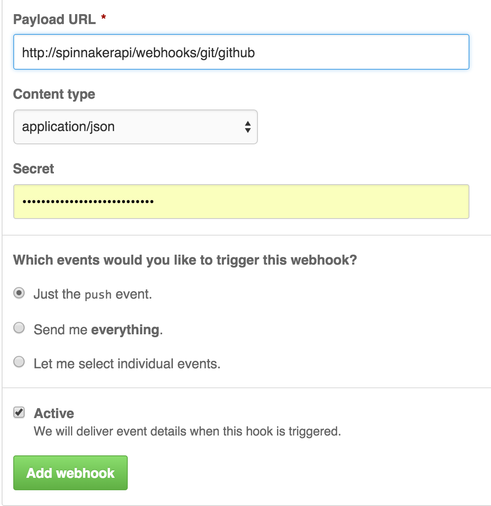

# Using Github as a Trigger

Go to your project's Webhooks page, i.e, https://github.com/spinnaker/igor/settings/hooks

Click "Add webhook"

{ width: 200px; }

enter http://[spinnakerapi]/webhooks/git/github in the Payload URL where spinnakerapi is the location of your gate installation.

select "Just the push event"

make it active

Click "Add Webhook"

# Add Git Trigger in Pipeline:

Go to Pipeline > Configuration

Select Trigger Type to be Git

Set Repository Type to be github

Enter your Repository organization / user

Enter your Repository name

# Notes

You can access the hash of the build via expression ```${trigger.hash}```


