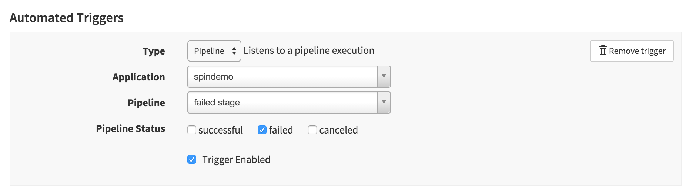
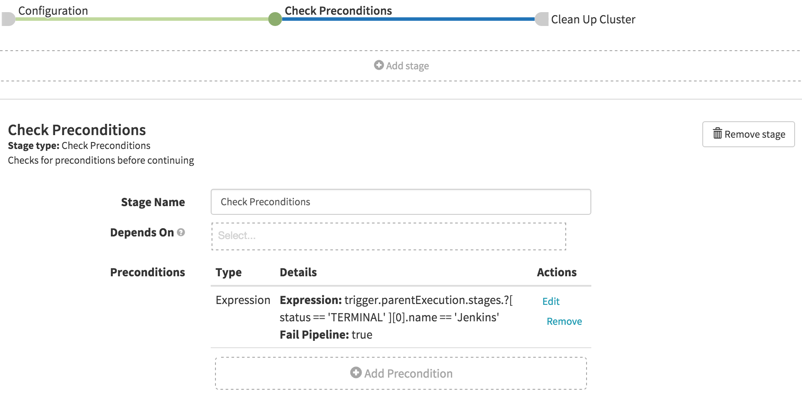

# Run a cleanup pipeline when a parent pipeline fails.

* Create a pipeline
* Click 'Configuration'
* Add a trigger to be the parent pipeline
* Check [ ] failed on the triggering condition



# Only run cleanup if a certain stage has failed. 

You can use a precondition to only run the cleanup based on a known stage.



For example, if I want to check that the stage that failed was called Jenkins, I would:

1. add a precondition stage
2. select type to be expression
3. enter the following expression
```
trigger.parentExecution.stages.?[ status == 'TERMINAL' ][0].name == 'Jenkins'
```
4. add any stages contingent after this stage. 